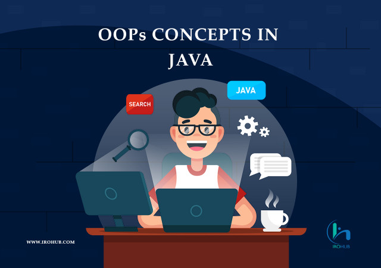

# Java-Programming
Dive into Java's object-oriented paradigm with a collection of concise yet powerful programs. Explore encapsulation, inheritance, polymorphism, and abstraction through real-world Java examples. Contribute, learn, and master Java's OOP principles here! Happy coding!

